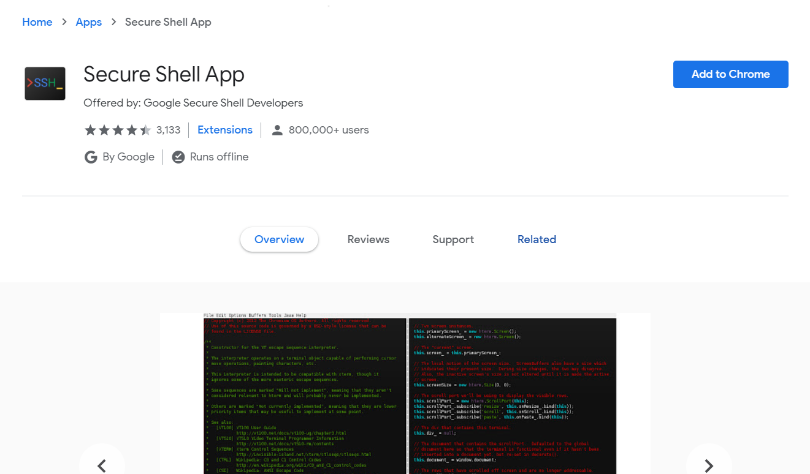
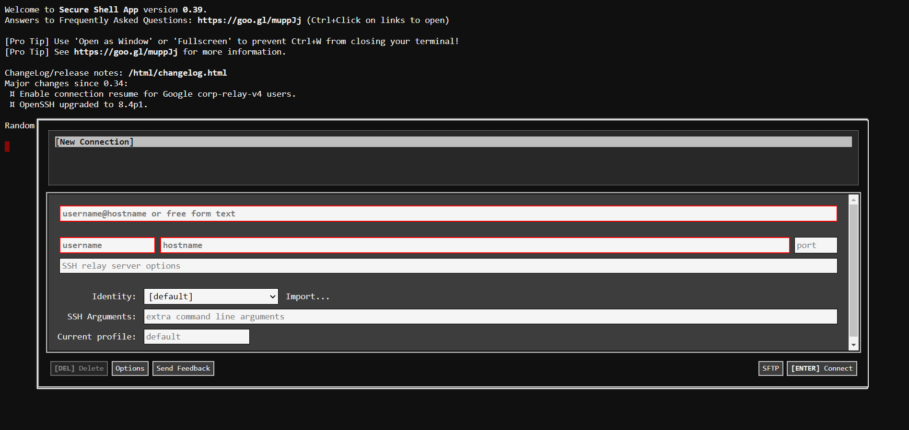
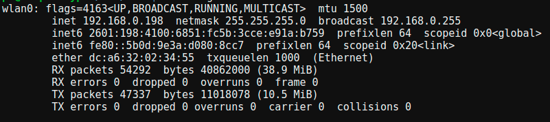
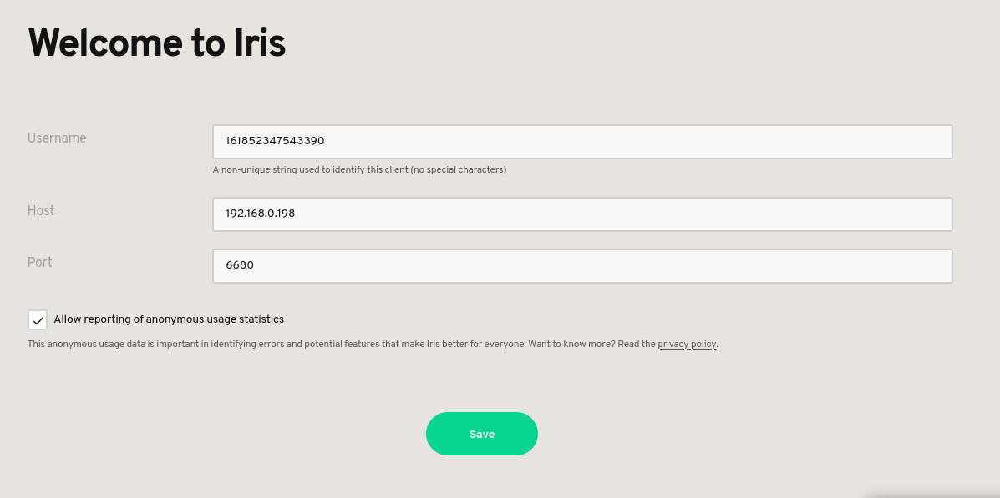
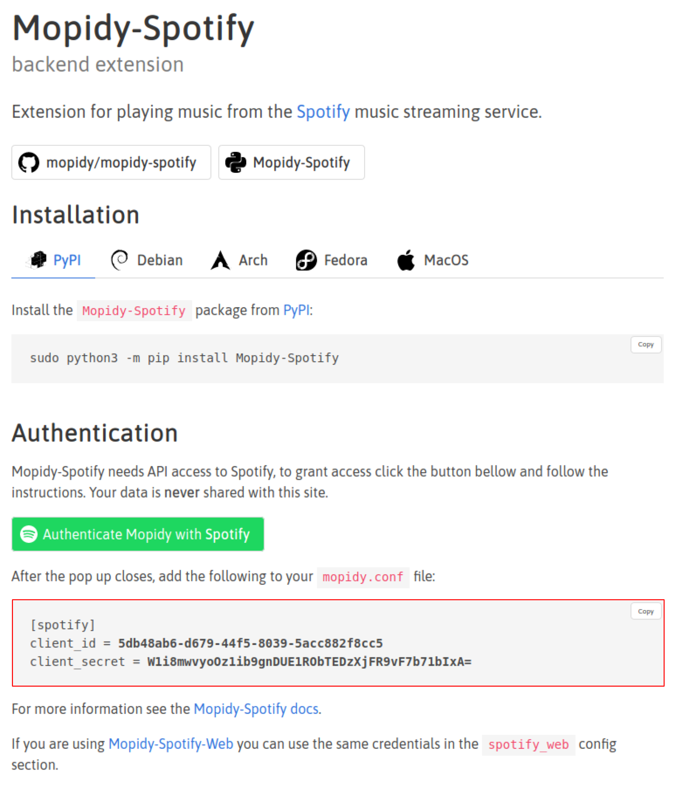
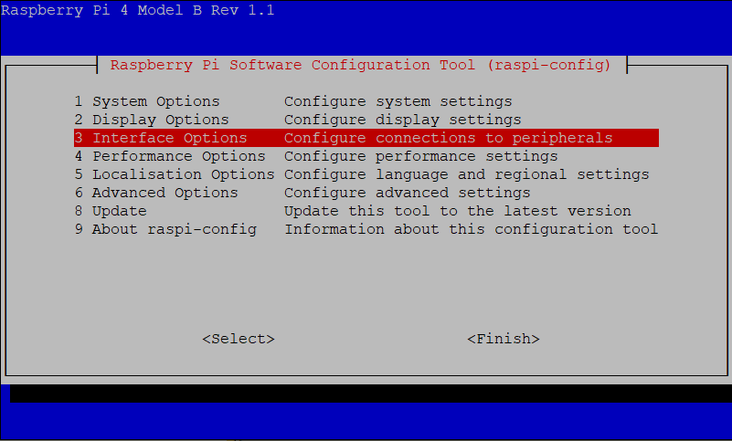
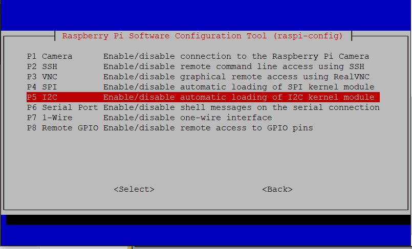
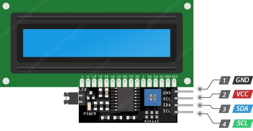

# Raspberry Pi Internet Radio Tutorial

## Connecting your Raspberry Pi to your Chromebook
To access your Pi from a Chromebook, you'll need to install the [Secure Shell Extension](https://chrome.google.com/webstore/detail/secure-shell-app/pnhechapfaindjhompbnflcldabbghjo?hl=en-US)
by clicking "Add Extension" in the Chrome web store.
<br/><br/>

<br/><br/>
This extension will allow you to control your Pi with a secure **shell** (also called a **terminal**, or **SSH**), a type of program designed for executing commands without a **Graphical User Interface** – the traditional, display-based way you interact with an operating system.
Instead of clicking buttons and opening windows, you will tell the computer to perform tasks using text statements in the **bash** coding language.

### Creating a Connection
When you open the Secure Shell App from your extensions menu, you'll see the following screen:
<br/><br/>

<br/><br/>
In the "username" field, enter `pi`. This is the default name for the Raspberry Pi's admin account.
In the "hostname" field, enter `raspberrypi.local`. This is the name that your Chromebook uses to communicate with the Pi over ethernet.
Finally, in the "port" field, type the number `22`. This is the specific address that the Chromebook will connect to the Pi on.
Once you've added this information, press enter to start connecting.
<br/><br/>
After the connection window closes, you may see security warning. You can just type `yes` to continue.
The next thing you'll see is a line in the shell asking for a password. By default, this is set to `raspberry` (it can be changed later).

### Setting up Wi-fi
Once you successfully login to your Pi, you're ready to start executing commands.
For the device to work as an internet radio, you'll need to set up a wi-fi connection by editing the `/etc/wpa_supplicant/wpa_supplicant.conf` file.
In the shell, type the following line and press enter:
```bash
sudo nano /etc/wpa_supplicant/wpa_supplicant.conf
```
This will open a text editor, where you'll need to add the following content:
```bash
country=US
ctr_interface=DIR=/var/run/wpa_supplicant GROUP=netdev
update_config=1

network={
    ssid="network name"
    psk="network password"
    id_str="primary_network"
    priority=1
}
```
Replace `network name` and `network password` with the name and password of the network you'd like to connect to.
If you'd like to use multiple networks, simply add another `network={...}` block with `priority=2`, as well as the appropriate name and password.
<br/><br/>
Once you've finished editing the file, press the `ctrl + x` keys. The editor will prompt on whether you want to save the file, to which you can respond `Y`.
It will then ask for the name the file should be saved under. Press `enter` to avoid changing it.
<br/><br/>
After you successfully exit the editor and return to the shell, restart the Pi by typing
```bash
sudo reboot
```
and pressing `enter`.
<br/><br/>
The secure shell will disconnect and ask if you would like to `(R)econnect, (C)hoose another connection, or E(x)it?`.
Wait until the Pi's power indicator light has been on for a few seconds and then press `R` to reconnect. Enter `raspberry` as the password to get back into the shell.
If all of the network information you entered was correct, your Pi should now be connected to the internet.

### Installing Mopidy
With an internet connection, you can now install the Mopidy server. In the shell, type the following lines, pressing `enter` after each.
```bash
wget -q -O - https://apt.mopidy.com/mopidy.gpg | sudo apt-key add -
sudo wget -q -O /etc/apt/sources.list.d/mopidy.list https://apt.mopidy.com/buster.list
sudo apt update
sudo apt install mopidy
```
Once those commands finish, enable and start the service by entering the following:
```bash
sudo systemctl enable mopidy
sudo usermod -aG video mopidy
sudo systemctl start mopidy
```
Next, you'll want to set up Iris, a web interface for Mopidy. This can also be done in the shell with the following command:
```bash
sudo pip3 install Mopidy-Iris
```
After pressing enter to download Iris, edit the Mopidy configuration file with
```bash
sudo nano /etc/mopidy/mopidy.conf
```
Add the following lines to the bottom of the file and follow the same steps from editing `wpa_supplicant.conf` to exit once you're done:
```bash
[http]
hostname = 0.0.0.0

[audio]
output = alsasink device = hw:0,0
```
Next, run
```bash
sudo systemctl restart mopidy
```
to refresh Mopidy. The server will run on the Pi's local IP address, which can be found by running
```bash
ifconfig -a wlan0
```
The output should look something like this:
<br/><br/>

<br/><br/>
The first address in the second line (listed after `inet`) is where the Mopidy server is configured to run. In the example above, it's running on `192.168.0.198`.
<br/><br/>
Now, you can access the Iris web interface by going to `http://your_ip:6680/iris`, replacing `your_ip` with the IP address you just found. You should see the following screen:
<br/><br/>

<br/><br/>
You can leave all of these settings as their default values (yours might not match those shown above; that's OK) and click the "Save" button.
Once you do, you'll see a "Now Playing" page and several options in a vertical menu on the left.
You can click the "Settings" option towards the bottom to connect a Spotify, LastFM, or Genius account.

#### Connecting YouTube Music
The simplest way to listen to music on Mopidy is using YouTube Music. Simply run each of the following two commands in terminal:
```bash
sudo pip3 install Mopidy-YTMusic
sudo systemctl restart mopidy
```

#### Connecting YouTube
To listen to any video on YouTube, install the Mopidy-Youtube extension with the following command:
```bash
sudo pip3 install Mopidy-YouTube
```
Then, edit Mopidy's configuration with `sudo nano /etc/mopidy/mopidy.conf` and paste the following lines:
```bash
[youtube]
enabled = true
```
After exiting the text editor, restart the Mopidy service using
```bash
sudo systemctl restart mopidy
```

#### Connecting Spotify
If you'd like to connect Spotify, you will first need to authorize the service by clicking the "Authenticate Mopidy with Spotify" button on [this](https://mopidy.com/ext/spotify/) webpage and agreeing to the listed terms (you also need to be logged in to Spotify). Then, make note of the configuration highlighted below:
<br/><br/>

<br/><br/>
This contains the specific credentials Mopidy needs to access your account. Open Mopidy's configuration file with `sudo nano /etc/mopidy/mopidy.conf` and type the configuration details exactly as they appear on your Spotify authorization page. Below them, add
```bash
username = "your Spotify username"
password = "your Spotify password"
```
 Then, exit the editor and install the Spotify extension with the commands below:
```bash
sudo apt install mopidy-spotify
sudo pip3 install Mopidy-Spotify
sudo systemctl restart mopidy
```
Now, you should be able to reload Iris and finish setting up Spotify.

## Setting up the I2C Display
### Enabling I2C
Before you start wiring your display, you'll need to enable I2C on the Pi. Access the configuraton menu by entering
```bash
sudo raspi-config
```
Once a menu shows up, use your arrow keys to navigate to `Interface Options`.

Press enter to see a new set of options and arrow down to `I2C`.

Press enter again and select `Yes` on the prompt that shows up. Finally, click the `Finish` button to return to the shell

### Wiring
Before doing any wiring work, use `sudo shutdown now` to turn off your Pi and unplug its power source.
On the back of your I2C display, you should see four pins: VCC, GND (Ground), SDA, and SCL.
<br/><br/>

<br/><br/>
Each of these pins needs to be connected to a corresponding pin on the Pi's **General Purpose Input/Output** (GPIO) header using a jumper wire.
<br/><br/>

<br/><br/>
Ground on the display should be connected to ground on the Pi (pin 6), VCC should be connected to a 3.3v Power source (pin 1), SDA should be connected to GPIO 2 (pin 3), and SLC should be connected to GPIO 3 (pin 5). Once all of these pins are wired properly, plug the power source back in to your Pi, wait a few seconds, and select the `(R)econnect` option in shell.

### Configuring the display
Once you're back in the shell, run each of the following commands to install the display code and drivers:
```bash
sudo apt install python3-pil
sudo pip3 install adafruit-circuitpython-ssd1306 mopidy-async-client RPi.GPIO
git clone https://github.com/isaackrementsov/mopidy-i2c
```
Then, start the Mopidy-I2C service with:
```bash
cd mopidy-i2c
sudo bash ./install_service
sudo systemctl start mopidy-i2c
```
and change the current track in Iris. If everything was configured correctly, you should see the name of the track currently playing displayed on the screen.
If you change the track, the display should update.
