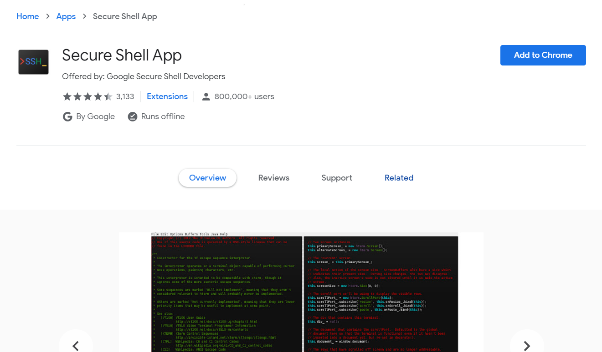
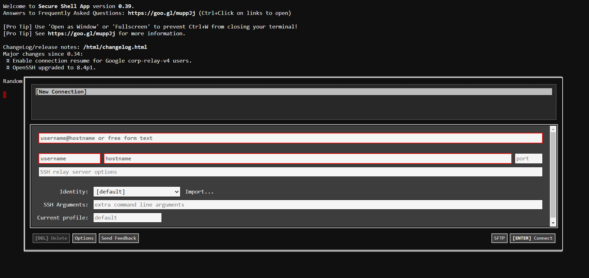

# Raspberry Pi Internet Radio Tutorial
## Connecting your Raspberry Pi to your Chromebook
To access your Pi from a Chromebook, you'll need to install the [Secure Shell Extension](https://chrome.google.com/webstore/detail/secure-shell-app/pnhechapfaindjhompbnflcldabbghjo?hl=en-US)
by clicking "Add Extension" in the Chrome web store.

This extension will allow you to control your Pi with a secure **shell** (also called a **terminal**, or **SSH**), a type of program designed for executing commands without a **Graphical User Interface** – the traditional, display-based way you interact with an operating system.
Instead of clicking buttons and opening windows, you will tell the computer to perform tasks using text statements in the **bash** coding language.
### Creating a Connection
When you open the Secure Shell App from your extensions menu, you'll see the following screen:

In the "username" field, enter `pi`. This is the default name for the Raspberry Pi's admin account.
In the "hostname" field, enter `raspberrypi.local`. This is the name that your Chromebook uses to communicate with the Pi over ethernet.
Finally, in the "port" field, type the number `22`. This is the specific address that the Chromebook will connect to the Pi on.
Once you've added this information, press enter to start connecting.
 After the connection window closes, you may see security warning. You can just type `yes` to continue.
The next thing you'll see is a line in the shell asking for a password. By default, this is set to `raspberry` (it can be changed later).
### Setting up Wifi
Once you successfully login to your Pi, you're ready to start using
